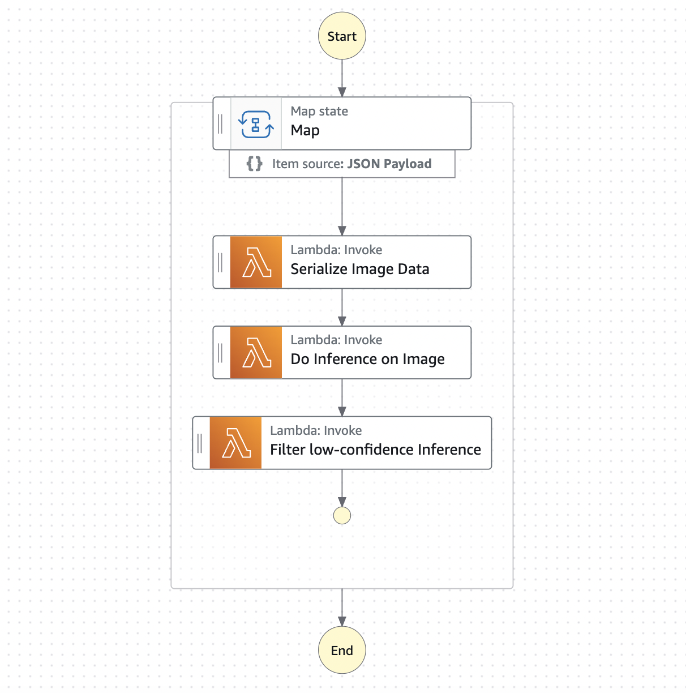
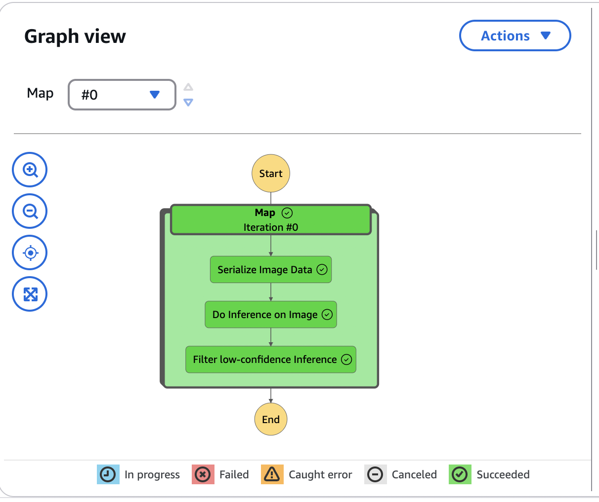

# 🧁 scones-ml-workflow  
**AWS Machine Learning Engineer Nanodegree Project**

This project is designed for **Scones Unlimited**, a fictional logistics company that delivers freshly baked scones. The goal is to streamline their delivery operations by building and deploying an image classification system that detects the type of vehicle used by each delivery driver. This helps automatically route drivers to the correct loading bay based on whether they’re using a **bicycle** or a **motorcycle**.

As the Machine Learning Engineer, my task was to build a **safe**, **scalable**, and **reproducible** end-to-end ML workflow using **AWS cloud services**.

---

## 🔧 Project Workflow

### 1. **Data Staging**
- Performed ETL (Extract, Transform, Load) operations on the **CIFAR-100** dataset.
- Filtered and structured the data to focus on relevant vehicle classes.
- Uploaded preprocessed data to **Amazon S3** for use in model training and inference.

### 2. **Model Training & Deployment**
- Trained a custom image classification model using the CIFAR-100 dataset.
- Tuned hyperparameters to optimize performance for vehicle detection.
- Deployed the trained model to an **Amazon SageMaker endpoint**.

### 3. **Inference Workflow (Lambdas & Step Functions)**
- Built a **serverless architecture** using:
  - **AWS Lambda** for processing and invoking inference
  - **AWS Step Functions** to orchestrate the workflow end-to-end
- Enabled fully automated classification of vehicle images stored in S3.
- Optimized the workflow by enabling parallel compute of inference

### 4. **Monitoring & Evaluation**
- Implemented inference result logging and confidence score tracking.
- Created visual dashboards to evaluate model performance over time.

---

## ☁️ Technologies Used

- **Amazon S3** – Data storage  
- **AWS Lambda** – Serverless compute for preprocessing and inference  
- **AWS Step Functions** – Workflow orchestration  
- **Amazon SageMaker** – Model training and hosting  
- **Amazon CloudWatch** – Monitoring and logging  

---

## 📈 Key Features

- End-to-end, production-ready ML pipeline  
- Fully automated inference and classification  
- Modular and scalable cloud-based architecture    
- Data visualization for inference confidence trends

## Step Function Workflow (parallel)

## Step Function performs successful inference

